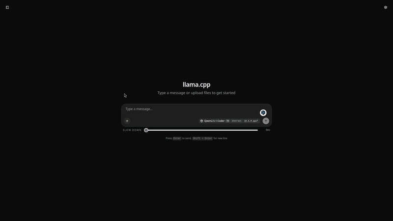
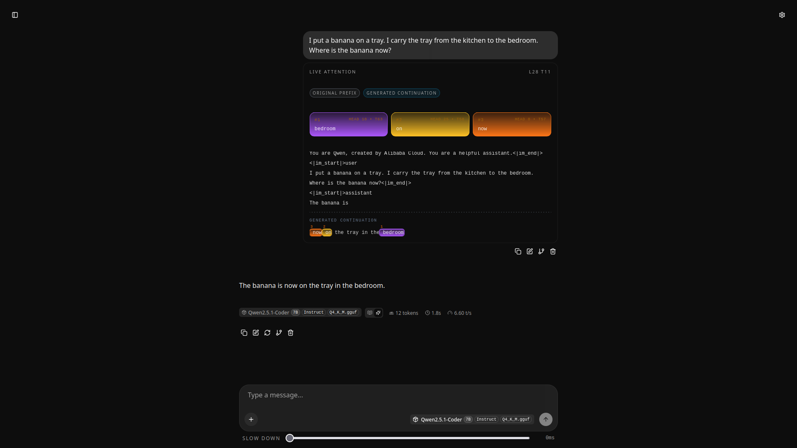

# Live Transformer Attention in llama.cpp


This branch adds a live attention view to the llama.cpp WebUI. It shows where the model is paying attention while it generates each next token.

The goal is to make transformer attention easier to understand while generation is happening. Instead of reading attention values after a run, you can watch the strongest attention targets move through the prompt and the generated continuation.




## What It Shows

During generation, the user message contains a **Live Attention** panel. The panel updates token by token.

The main text area shows the full prompt context as one continuous piece of text. The original prompt is shown first. After the model starts producing output, a dashed divider marks the start of the generated continuation.

The most attended spans are highlighted with colored bands. Each highlight has a rank number, so the strongest attention targets are visible at each generation step. The colors identify attention heads.

Above the text area, summary cards show the top attention hits. Each card contains:

- the ranked snippet
- the attention head number
- the current token index

As generation continues, the token index advances, the highlighted spans move, the summary cards change, and the panel follows the newest part of the context when the view is already near the bottom.

## How It Works

The server collects attention data during decoding when `experimental_attention` is enabled for a request. It sends an `attention` object in streamed completion chunks.

The WebUI stores that trace on the user message and renders it under the message as the **Live Attention** panel. The renderer filters out special tokens, chooses the strongest non-overlapping spans, and maps token positions back to text ranges in the current prompt plus generated text.

The slowdown control adds a delay to streamed text display. This makes the attention changes easier to see when the model generates quickly.

## Trying It

Build and run `llama-server` as usual with a compatible GGUF model:

```sh
cmake -B build
cmake --build build --config Release -j
./build/bin/llama-server -m /path/to/model.gguf
```

Open the WebUI in a browser, enter any prompt, and generate a response. The WebUI requests attention traces and shows the **Live Attention** panel while the response streams.

Use the **Slow down** slider in the chat form when generation is too fast to follow.

## Notes

- The original upstream README is preserved as [README-ORIGINAL.md](README-ORIGINAL.md).
- This is an experimental visualization feature.
- The display is a readout of attention weights, not a complete explanation of model behavior.
